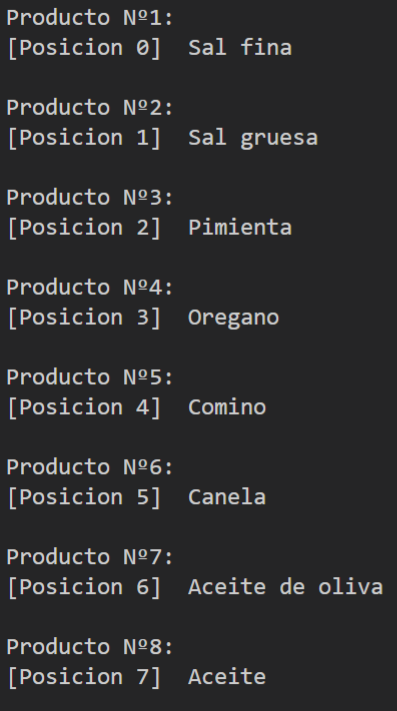
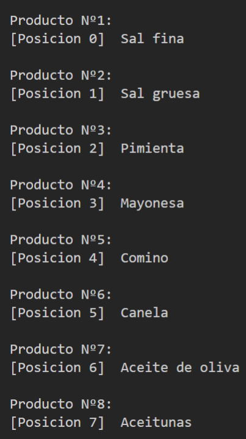
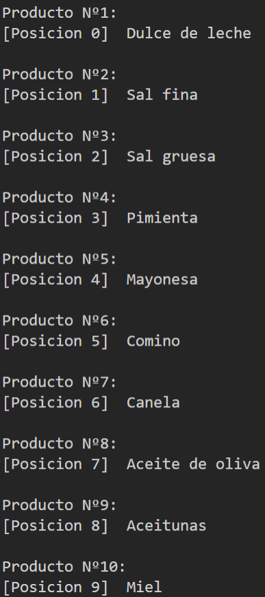
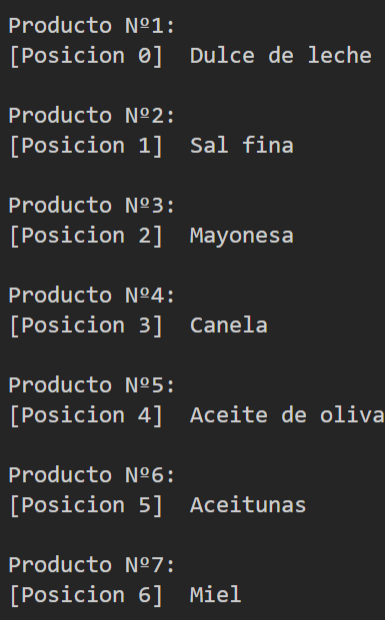

# Practica 2-3

- Documentacion recomendada: [Array](https://developer.mozilla.org/es/docs/Web/JavaScript/Reference/Global_Objects/Array)

    

    >**_Realizar la practica en el orden indicado_** El codigo también debe seguir el mismo orden
    

1. Crear un array que contenga a los siguientes productos:
    - Sal fina
    - Sal gruesa
    - Pimienta
    - Oregano
    - Comino
    - Canela
    - Aceite de oliva
    - Aceite
    
     

1. Mostrar los productos en consola como en la siguiente imagen:

    
    
     

1. Actualizar el array con tal de que el resultado en consola luego sea:

    
    
     

1. Insertar ``Dulce de leche`` al principio del array y `Miel` al final:

    
    
     

1. Eliminar el producto `Comino, Pimienta, Sal gruesa` del array:

    
    
     

**Metodo de entrega**
>Todo el codigo de cada punto debe estar en el script del repositorio a entregar

>Cada punto dentro del script debe contar con un comentario explicando **_con sus palabras_** que es lo que sucedio

 

>Aclaracion: Todos los resultados de los puntos menos el primero deben poder verse en la consola

 
 

**_Extra 1_**

- Insertar `Pringles` en la posicion `3`
- Insertar `Agua mineral` en la posicion `5`
- Insertar `Terma` en la posicion `3`

 

>Analizar el resultado obtenido

**_Extra 2_**

- Intercambiar lugares entre `Pringles` y  `Terma`
- Intercambiar lugares entre `Miel` y` Aceite de oliva`

 

>Analizar el resultado obtenido

